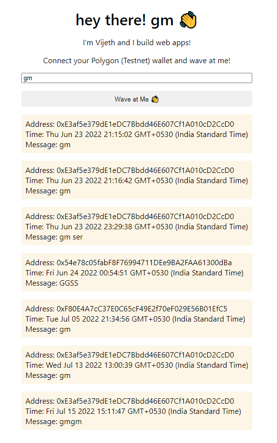
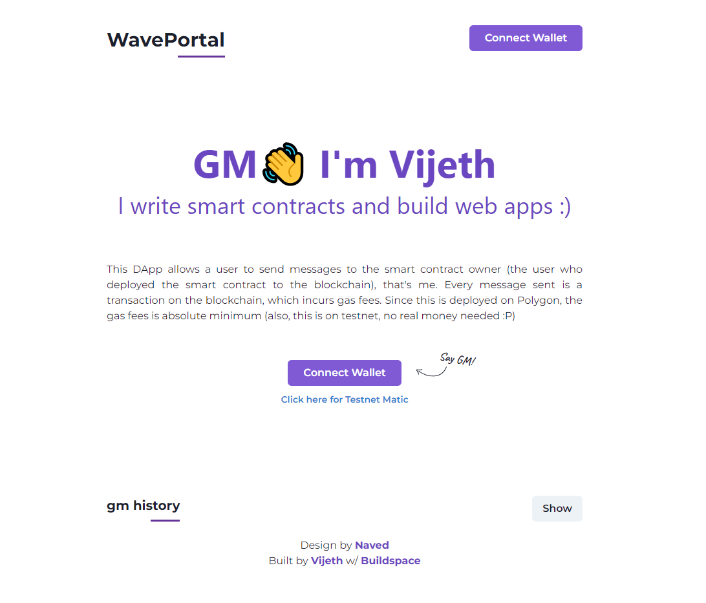

# WavePortal 2.0

Send waves on the blockchain!

## What's new?

- Multi Wallet Support w/ Rainbowkit
- User friendly UI w/ Chakra UI
- Responsive Design

## Screenshots




## Run Locally

Clone the project

```bash
  git clone https://github.com/vijethx/waveportal-frontend
```

Go to the project directory

```bash
  cd my-project
```

Install dependencies

```bash
  yarn
```

Start the server

```bash
  yarn start
```

## Feedback

If you have any feedback, either create an issue in the repo or reach out to me on [Twitter]('https://twitter.com/vijethx')
